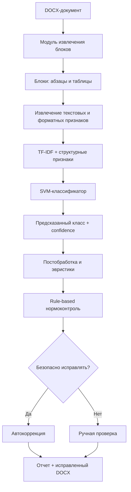

# PRD: GOST Formatter

**Версия:** 1.0  
**Дата:** 2026-05-01  
**Статус:** Draft  
**Источник требований:** файл `Почти финал.docx`  
**Продукт:** система автоматизированного анализа и частичного оформления текстовых документов по требованиям ГОСТ  
**Кодовое имя:** `gost_formatter`

---

## 1. Проблема и продуктовый контекст

### 1.1 Problem Statement

Пользователи, подготавливающие учебные, научно-технические и официально-деловые документы, вынуждены вручную контролировать большое количество требований к оформлению: структуру разделов, параметры шрифта, интервалы, отступы, выравнивание, нумерацию, подписи к таблицам и рисункам, список источников и иные элементы нормоконтроля.

Ручное оформление плохо масштабируется, зависит от внимательности автора и часто приводит к повторным итерациям исправлений. Даже если документ визуально выглядит корректным, его внутренняя структура может быть нарушена: заголовки могут быть оформлены вручную без стилей, списки могут быть созданы пробелами и табуляциями, а подписи и библиографические элементы могут не иметь явной машинной разметки.

Система `gost_formatter` должна автоматизировать первичный диагностический нормоконтроль DOCX-документов: извлекать структурные блоки, классифицировать их функциональные роли, сопоставлять оформление с формализованными правилами, формировать отчет и выполнять только безопасные автоматические исправления.

### 1.2 Доказательства и основания

- Входной документ рассматривается как последовательность структурных блоков: абзацев, таблиц, заголовков, подписей, элементов списков и библиографических записей.
- Для определения роли блока недостаточно только визуального форматирования; требуется совместный учет текста, структурных и форматных признаков.
- В фактической реализации основной формат обработки — DOCX, поскольку он содержит объектную модель документа: абзацы, таблицы, стили, выравнивание, отступы и иные параметры.
- Практическая реализация использует гибридный подход: машинное обучение для классификации блоков и правило-ориентированный слой для нормоконтроля.
- Система не должна позиционироваться как полностью автономный «исправитель всего документа». Ее корректная продуктовая роль — инструмент диагностического нормоконтроля с ограниченной безопасной автокоррекцией.

### 1.3 Почему сейчас

Объем электронных документов, подлежащих формальному нормоконтролю, растет. В образовательных и научных организациях значительная часть документов должна соответствовать ГОСТ и локальным методическим требованиям. При этом существующие шаблоны и редакторские инструменты не восстанавливают нарушенную структуру документа, а классические rule-based проверки не способны надежно интерпретировать смысловую роль блока без предварительной классификации.

Сейчас рационально развивать систему, которая сочетает:

1. извлечение структуры DOCX;
2. классификацию текстовых блоков;
3. формализованные правила оформления;
4. объяснимый отчет;
5. консервативную автокоррекцию только в безопасных случаях.

### 1.4 Ключевая гипотеза

Мы считаем, что **гибридная система, объединяющая SVM-классификатор структурных блоков и rule-based слой нормоконтроля**, позволит **сократить объем ручной проверки DOCX-документа** и повысить воспроизводимость анализа оформления.

Гипотеза считается подтвержденной, если система:

- корректно извлекает блоки из DOCX-документа;
- присваивает каждому блоку функциональную роль с приемлемым качеством классификации;
- формирует объяснимый отчет по нарушениям;
- не применяет автокоррекцию к неоднозначным или небезопасным блокам;
- сохраняет возможность ручной проверки спорных случаев.

### 1.5 Ключевые метрики успеха

| Метрика | Базовое значение | Цель | Срок / этап |
|---|---:|---:|---|
| Accuracy классификации блоков | по текущим экспериментам около 94% | ≥ 94% | MVP / текущая версия |
| Weighted F1 классификации | по текущим экспериментам около 0.95 | ≥ 0.94 | MVP / текущая версия |
| Macro F1 | ниже weighted F1 из-за редких классов | отслеживать отдельно, не ухудшать | MVP |
| Доля блоков с объяснимым статусом | N/A | 100% обработанных блоков | MVP |
| Доля небезопасных исправлений, заблокированных системой | N/A | 100% выявленных небезопасных случаев | MVP |
| Наличие отчета нормоконтроля | N/A | отчет формируется для каждого запуска audit | MVP |
| Возможность скачать исправленный DOCX | N/A | доступна при наличии безопасных исправлений | MVP |
| Время обработки типового DOCX | N/A | приемлемо для интерактивного использования | MVP / UI |

### 1.6 Принципы проектирования

1. **Безопасность важнее агрессивной автоматизации.** Система не должна разрушать структуру документа ради формального применения правил.
2. **Объяснимость каждого решения.** Каждый статус, нарушение и исправление должны сопровождаться причиной: предсказанный класс, правило, параметр, ожидаемое и фактическое значение.
3. **Разделение вероятностного и детерминированного уровней.** Классификатор определяет функциональную роль блока, а rule-based слой применяет нормативные проверки.
4. **Модульность.** Извлечение, признаки, модель, постобработка, правила, аудит, отчет и UI должны быть независимыми компонентами.
5. **Воспроизводимость.** Каждый режим должен сохранять промежуточные и итоговые результаты в файлы, пригодные для повторной проверки.
6. **Ограниченный scope реализации.** DOCX является основным форматом MVP. PDF, OCR и мультимодальная обработка относятся к перспективам развития.
7. **Пользователь остается финальным контролером.** Спорные блоки переводятся в ручную проверку, а не исправляются безусловно.

---

## 2. Пользователи и контекст

### 2.1 Целевые пользователи

| Роль | Описание | Текущее поведение | Триггер потребности | Основные сценарии |
|---|---|---|---|---|
| Автор учебной или научной работы | Студент, магистрант, аспирант, исследователь, готовящий документ по ГОСТ | Редактирует документ вручную, сверяет требования с методичкой, исправляет замечания после нормоконтроля | Нужно быстро проверить документ перед сдачей | Загрузить DOCX, получить отчет, исправить типовые нарушения, скачать отформатированную копию |
| Специалист нормоконтроля | Проверяет документы на соответствие требованиям ГОСТ и локальным правилам | Просматривает документ вручную, отмечает нарушения, возвращает автору на исправление | Нужно ускорить первичную диагностику | Получить структурированный отчет по блокам и нарушениям, отфильтровать спорные места |
| Научный руководитель / преподаватель | Проверяет работу студента перед сдачей | Дает общие замечания по содержанию и оформлению | Нужно быстро увидеть основные проблемы оформления | Получить сводку: количество нарушений, критичные блоки, проблемные разделы |
| Разработчик / ML-инженер проекта | Поддерживает pipeline, модель, правила и интерфейс | Запускает обучение, оценку, предсказания, аудит через CLI | Нужно воспроизводимо улучшать систему | Обучить модель, оценить метрики, проанализировать ошибки, обновить правила |

### 2.2 Job to Be Done

**Основной JTBD:**  
Когда мне нужно подготовить DOCX-документ к сдаче по требованиям ГОСТ, я хочу автоматически проверить структуру и оформление документа, чтобы быстро увидеть нарушения, исправить типовые безопасные ошибки и передать спорные случаи на ручную проверку.

**Дополнительные JTBD:**

- Когда я запускаю обучение модели, я хочу получить сохраненную модель, метрики и файлы ошибок, чтобы понимать качество классификации и проблемные классы.
- Когда я анализирую новый документ, я хочу получить предсказанные роли блоков и уровень уверенности, чтобы оценить надежность интерпретации структуры.
- Когда я применяю rule-based аудит, я хочу видеть список нарушенных правил и предлагаемых действий, чтобы каждое решение системы было проверяемым.
- Когда система не уверена в классе блока, я хочу, чтобы она пометила блок как требующий ручной проверки, а не изменила его автоматически.

---

## 3. Scope

### 3.1 Что делаем (In Scope)

- Загрузка и обработка DOCX-документов.
- Извлечение абзацев и таблиц как структурных блоков.
- Извлечение текстового содержимого блока.
- Извлечение форматных признаков: тип блока, выравнивание, стиль, жирность, отступы, межстрочный интервал и другие доступные параметры.
- Подготовка размеченного датасета блоков документов.
- Поддержка схемы данных: `doc_id`, `block_id`, `text`, `label_core`, `label_detailed`, `label_baseline`, `kind`, `alignment`, `style`, `bold_ratio`, `file_name`, `confidence`, `notes`, `split`.
- Формирование признакового пространства на основе TF-IDF и структурно-форматных признаков.
- Обучение модели классификации структурных блоков.
- Использование SVM как основной модели классификации.
- Поддержка логистической регрессии как baseline-эксперимента.
- Поддержка трансформерной модели RuBERT как экспериментального компонента, не являющегося основой MVP.
- Оценка качества модели на train/validation/test разбиении.
- Расчет accuracy, precision, recall, F1, weighted F1, macro F1.
- Формирование матрицы ошибок и файлов с ошибочными классификациями.
- Предсказание классов для новых блоков.
- Использование confidence score для принятия решения о ручной проверке.
- Rule-based слой нормоконтроля на основе JSON-правил.
- Проверка соответствия оформления блока ожидаемому профилю по его классу.
- Поддержка статусов блока: `no_change`, `changed`, `review`, `error`.
- Формирование полей аудита: `violated_rules`, `applied_fixes`, `explanation`, `manual_review_required`, `blocked_unsafe_autofix`.
- Безопасная автоматическая коррекция только при высокой уверенности и допустимости правила.
- Консервативная обработка списков и сложных DOCX-структур.
- Формирование CSV-отчета нормоконтроля.
- Формирование исправленного DOCX, если есть безопасные исправления.
- CLI-режимы: обучение, оценка, предсказание, извлечение DOCX-блоков, аудит DOCX.
- Streamlit-интерфейс для загрузки DOCX, запуска анализа, просмотра результатов и скачивания исправленного документа.
- Хранение результатов в файловой структуре проекта: модели, метрики, предсказания, отчеты, извлеченные блоки.

### 3.2 Что НЕ делаем (Out of Scope для MVP)

- Полноценная поддержка PDF как основного формата обработки.
- OCR для сканированных PDF и изображений.
- LayoutLM, LayoutLMv3 и другие мультимодальные модели как реализованная часть MVP.
- Полная автоматическая правка всех нарушений без участия пользователя.
- Гарантированная корректная обработка сложных многоуровневых таблиц.
- Агрессивная автокоррекция длинных текстовых фрагментов и неоднозначных списков.
- Полная автоматизация библиографического аппарата по всем вариантам ГОСТ.
- Серверная многопользовательская система с аккаунтами, ролями и базой данных.
- Облачная обработка документов через внешние Document AI API.
- Интеграции с Microsoft Word, Google Docs, LMS или системами электронного документооборота.
- Поддержка локальных требований каждого вуза без предварительной формализации правил.

### 3.3 Допущения

- Входной документ содержит извлекаемый текст.
- Основной входной формат MVP — DOCX.
- Документы преимущественно русскоязычные.
- Документы относятся к учебному, научно-техническому или официально-деловому стилю.
- Нормативная корректность проверяется по формализованным правилам, а не по свободному тексту ГОСТ.
- Некоторые правила могут быть представлены не как автокоррекция, а как рекомендация.
- Редкие классы могут распознаваться хуже из-за дисбаланса данных.
- Пользователь или эксперт нормоконтроля выполняет финальную проверку спорных случаев.
- Расширение на PDF/OCR возможно в следующих версиях, но не является обязательным требованием текущей реализации.

---

## 4. Backbone: путь документа через систему

```text
DOCX-документ
  → извлечение структурных блоков
  → очистка и нормализация признаков
  → формирование TF-IDF + форматных признаков
  → классификация блоков
  → постобработка предсказаний
  → rule-based аудит оформления
  → решение: no_change / changed / review / error
  → отчет нормоконтроля
  → исправленный DOCX при наличии безопасных исправлений
```



### 4.1 Режимы системы

| Режим | Назначение | Вход | Выход |
|---|---|---|---|
| `train` | Обучение классификатора | train/val/test CSV | модель, метрики, отчеты |
| `evaluate` | Оценка модели | тестовый CSV, сохраненная модель | метрики, classification report, confusion matrix |
| `predict` | Предсказание классов | CSV с блоками | CSV с предсказаниями и confidence |
| `extract-docx` | Извлечение блоков из DOCX | DOCX | CSV с блоками и признаками |
| `audit-docx` | Нормоконтроль документа | DOCX + predictions CSV / модель | отчет нарушений, исправленный DOCX при безопасных правках |
| `streamlit-ui` | Пользовательский сценарий без CLI | DOCX + выбранный профиль | визуальная сводка, таблица блоков, отчет, скачивание результата |

---

## 5. Функциональные требования

### [EPIC-001] Загрузка и валидация входных документов

---

**[US-001][Пользователь] Как пользователь, я хочу загрузить DOCX-документ, чтобы система выполнила его анализ.**

- [ ] Система принимает файл с расширением `.docx`.
- [ ] При загрузке проверяется существование файла и корректность расширения.
- [ ] При ошибке чтения система возвращает понятное сообщение.
- [ ] Документ не должен изменяться на этапе первичного чтения.
- [ ] Для каждого запуска должен фиксироваться путь к исходному документу.
- Notes: PDF не является обязательным форматом MVP. Сканированные документы и OCR не входят в текущий scope.

---

**[US-002][Система] Как система, я хочу проверять пригодность документа к обработке, чтобы не запускать pipeline на некорректных данных.**

- [ ] Система проверяет, что файл доступен для чтения.
- [ ] Система проверяет, что в документе есть извлекаемые абзацы или таблицы.
- [ ] Система фиксирует пустые блоки и может исключать их из классификации.
- [ ] Система не должна аварийно завершаться при встрече с нестандартным абзацем или таблицей.
- [ ] Ошибки извлечения должны попадать в лог или отчет обработки.

---

### [EPIC-002] Извлечение структурных блоков DOCX

---

**[US-003][Пользователь] Как пользователь, я хочу, чтобы система разбила документ на структурные блоки, чтобы каждый фрагмент анализировался отдельно.**

- [ ] Система извлекает абзацы DOCX.
- [ ] Система извлекает таблицы DOCX как отдельные структурные элементы.
- [ ] Для каждого блока сохраняется `block_id` в порядке следования в документе.
- [ ] Для каждого блока сохраняется `doc_id` или имя исходного документа.
- [ ] Порядок блоков в выходном CSV должен соответствовать порядку в документе.

---

**[US-004][Система] Как система, я хочу извлекать форматные признаки блока, чтобы использовать их при классификации и нормоконтроле.**

- [ ] Для блока сохраняется текстовое содержимое `text`.
- [ ] Для блока сохраняется физический тип `kind`: абзац, таблица или иной поддерживаемый тип.
- [ ] Для абзаца извлекается выравнивание `alignment`, если оно доступно.
- [ ] Для абзаца извлекается стиль `style`, если он доступен.
- [ ] Для блока вычисляется `bold_ratio` как доля полужирного текста.
- [ ] По возможности извлекаются параметры отступов и интервалов.
- [ ] Если признак недоступен, система должна использовать безопасное значение по умолчанию или `null`, а не падать.

---

### [EPIC-003] Датасет и схема разметки

---

**[US-005][ML-инженер] Как ML-инженер, я хочу иметь единую схему датасета, чтобы обучение, оценка и предсказание работали согласованно.**

- [ ] Схема датасета включает обязательные поля: `doc_id`, `block_id`, `text`, `label_core`, `kind`, `alignment`, `style`, `bold_ratio`.
- [ ] Схема допускает дополнительные поля: `label_detailed`, `label_baseline`, `file_name`, `confidence`, `notes`, `split`.
- [ ] Поле `text` используется как основной текстовый вход.
- [ ] Поле `label_core` используется как основная целевая метка итоговой классификации.
- [ ] Поле `label_detailed` может использоваться для анализа более тонких классов.
- [ ] Поле `split` определяет принадлежность строки к train/val/test.

---

**[US-006][ML-инженер] Как ML-инженер, я хочу контролировать качество разметки, чтобы модель не обучалась на противоречивых данных.**

- [ ] Система проверяет наличие обязательных колонок.
- [ ] Система проверяет пустые значения в `text` и `label_core`.
- [ ] Система формирует распределение классов.
- [ ] Система формирует распределение документов по split.
- [ ] Редкие классы должны быть явно отражены в отчете качества данных.
- [ ] Проблемные строки должны быть сохранены для ручной проверки.

---

### [EPIC-004] Формирование признакового пространства

---

**[US-007][Система] Как система, я хочу преобразовать текст блока в числовое представление, чтобы классификатор мог определить его функциональную роль.**

- [ ] Текстовые признаки формируются с использованием TF-IDF.
- [ ] TF-IDF обучается только на обучающей выборке в режиме train.
- [ ] Один и тот же fitted vectorizer используется для validation/test/predict.
- [ ] Параметры TF-IDF должны быть воспроизводимыми и сохраняться вместе с моделью.
- [ ] При пустом тексте блок должен обрабатываться корректно.

---

**[US-008][Система] Как система, я хочу объединять текстовые и форматные признаки, чтобы повысить качество классификации структурных блоков.**

- [ ] Категориальные признаки `kind`, `alignment`, `style` кодируются пригодным для модели способом.
- [ ] Числовой признак `bold_ratio` включается в итоговый вектор.
- [ ] Дополнительные признаки форматирования могут быть добавлены без изменения публичного интерфейса pipeline.
- [ ] Все преобразователи признаков сохраняются вместе с моделью.
- [ ] На этапе predict используется тот же набор преобразований, что и на train.

---

### [EPIC-005] Обучение модели классификации

---

**[US-009][ML-инженер] Как ML-инженер, я хочу обучить SVM-классификатор, чтобы система могла определять роли блоков документа.**

- [ ] Команда обучения принимает подготовленный CSV.
- [ ] Система использует `label_core` как целевую метку.
- [ ] Основной классификатор MVP — линейный SVM из scikit-learn.
- [ ] Должна поддерживаться настройка class weights для компенсации дисбаланса.
- [ ] После обучения модель сохраняется в `results/models` или аналогичную директорию.
- [ ] Вместе с моделью сохраняются параметры векторизации и кодирования признаков.
- [ ] Система сохраняет training metrics в JSON и/или TXT.

---

**[US-010][ML-инженер] Как ML-инженер, я хочу иметь baseline-модель, чтобы сравнивать качество SVM с простым подходом.**

- [ ] Система поддерживает логистическую регрессию как baseline-эксперимент.
- [ ] Baseline использует сопоставимое признаковое пространство.
- [ ] Метрики baseline сохраняются в отдельный отчет.
- [ ] Baseline не должен подменять основную модель в production/MVP-конфигурации.

---

**[US-011][ML-инженер] Как ML-инженер, я хочу иметь возможность запускать трансформерный эксперимент, чтобы оценивать альтернативный подход.**

- [ ] Трансформерная модель должна рассматриваться как экспериментальный компонент.
- [ ] Для русскоязычного текста допускается использование RuBERT-подобной модели.
- [ ] Обучение использует AdamW, cross-entropy и early stopping по validation metric.
- [ ] Результаты трансформера сравниваются с SVM.
- [ ] Если трансформер не дает устойчивого прироста, SVM остается основной моделью.
- Notes: Трансформер не является обязательным ядром текущего MVP из-за ограниченного объема данных и большей вычислительной сложности.

---

### [EPIC-006] Оценка качества модели

---

**[US-012][ML-инженер] Как ML-инженер, я хочу оценивать модель на отложенной выборке, чтобы понимать ее обобщающую способность.**

- [ ] Оценка выполняется на validation и test split.
- [ ] Система рассчитывает accuracy.
- [ ] Система рассчитывает precision, recall и F1 по классам.
- [ ] Система рассчитывает weighted F1.
- [ ] Система рассчитывает macro F1.
- [ ] Система сохраняет classification report.
- [ ] Система сохраняет confusion matrix.
- [ ] Система сохраняет список ошибочно классифицированных блоков.

---

**[US-013][ML-инженер] Как ML-инженер, я хочу видеть проблемные классы, чтобы улучшать датасет и правила.**

- [ ] Отчет должен показывать классы с низкими precision/recall/F1.
- [ ] Особое внимание уделяется `bibliography_item`, подписям к таблицам и рисункам, спискам и структурно близким классам.
- [ ] Ошибки между `bibliography_item` и `body_text` должны анализироваться отдельно.
- [ ] Система должна сохранять примеры ошибок с исходным текстом и предсказанием.

---

### [EPIC-007] Предсказание ролей блоков

---

**[US-014][Пользователь] Как пользователь, я хочу получить предсказанные роли блоков, чтобы понять структуру документа.**

- [ ] Команда predict принимает CSV с блоками и признаками.
- [ ] Для каждого блока система формирует `predicted_label`.
- [ ] Для каждого блока система формирует значение confidence, если модель и конфигурация это поддерживают.
- [ ] Результаты сохраняются в CSV.
- [ ] Порядок блоков в файле предсказаний соответствует исходному порядку документа.

---

**[US-015][Система] Как система, я хочу помечать низкоуверенные предсказания, чтобы не применять к ним опасные исправления.**

- [ ] Для confidence задается порог ручной проверки.
- [ ] Если confidence ниже порога, блок получает признак `manual_review_required = true`.
- [ ] Для низкоуверенных блоков автокоррекция запрещена.
- [ ] Причина ручной проверки фиксируется в `explanation`.

---

### [EPIC-008] Rule-based нормоконтроль

---

**[US-016][Специалист нормоконтроля] Как специалист нормоконтроля, я хочу формализовать правила оформления, чтобы система могла проверять документ воспроизводимо.**

- [ ] Правила хранятся в структурированном JSON-формате.
- [ ] Каждое правило имеет уникальный `id`.
- [ ] Каждое правило содержит `applicable_labels`.
- [ ] Каждое правило содержит `parameter`.
- [ ] Каждое правило содержит `expected_value`.
- [ ] Каждое правило содержит `action`.
- [ ] Каждое правило содержит `severity`.
- [ ] Каждое правило содержит `autocorrect`.
- [ ] Каждое правило содержит `priority`.
- [ ] Новые правила можно добавлять без изменения кода ядра.

---

**[US-017][Система] Как система, я хочу выбирать правила по предсказанному классу блока, чтобы проверять только релевантные требования.**

- [ ] Для каждого блока система получает предсказанный класс.
- [ ] Система выбирает подмножество правил, применимых к этому классу.
- [ ] Правила применяются в порядке приоритета.
- [ ] Для каждого правила сравнивается фактическое и ожидаемое значение параметра.
- [ ] Нарушения фиксируются в `violated_rules`.

---

**[US-018][Система] Как система, я хочу различать проверку и исправление, чтобы не применять небезопасную автокоррекцию.**

- [ ] Правило может работать в режиме проверки без исправления.
- [ ] Правило может работать в режиме безопасной автокоррекции.
- [ ] Автокоррекция допускается только при `autocorrect = true` и достаточной уверенности модели.
- [ ] Для неоднозначных структур автокоррекция блокируется.
- [ ] Блокировка фиксируется в `blocked_unsafe_autofix`.

---

### [EPIC-009] Обработка списков и сложных структур

---

**[US-019][Система] Как система, я хочу обрабатывать списки консервативно, чтобы не разрушить структуру DOCX-документа.**

- [ ] Для списков учитываются тип списка, уровень вложенности, отступы и табуляция, если эти признаки доступны.
- [ ] Если структура списка неоднозначна, система не применяет агрессивную автокоррекцию.
- [ ] Длинные текстовые фрагменты не должны автоматически преобразовываться в списки без высокой уверенности.
- [ ] Спорные списочные блоки переводятся в `review`.
- [ ] В отчете должна быть указана причина консервативного решения.

---

### [EPIC-010] Аудит документа и отчетность

---

**[US-020][Пользователь] Как пользователь, я хочу получить отчет нормоконтроля, чтобы увидеть все найденные нарушения и рекомендации.**

- [ ] Отчет формируется для каждого обработанного документа.
- [ ] Отчет содержит идентификатор блока.
- [ ] Отчет содержит текст или фрагмент текста блока.
- [ ] Отчет содержит предсказанный класс.
- [ ] Отчет содержит confidence.
- [ ] Отчет содержит статус блока: `no_change`, `changed`, `review`, `error`.
- [ ] Отчет содержит список нарушенных правил.
- [ ] Отчет содержит список примененных исправлений.
- [ ] Отчет содержит пояснение.
- [ ] Отчет содержит признак необходимости ручной проверки.
- [ ] Отчет сохраняется в CSV.

---

**[US-021][Пользователь] Как пользователь, я хочу видеть сводку по документу, чтобы быстро оценить состояние оформления.**

- [ ] Сводка показывает общее количество блоков.
- [ ] Сводка показывает количество блоков без изменений.
- [ ] Сводка показывает количество исправленных блоков.
- [ ] Сводка показывает количество блоков, требующих ручной проверки.
- [ ] Сводка показывает количество ошибок обработки.
- [ ] Сводка должна быть доступна в CLI-выводе и UI.

---

### [EPIC-011] Формирование исправленного DOCX

---

**[US-022][Пользователь] Как пользователь, я хочу скачать исправленную версию документа, чтобы продолжить работу с ней в Word.**

- [ ] Исправленный документ создается только при наличии безопасных исправлений.
- [ ] Исходный документ не перезаписывается.
- [ ] Исправленный документ сохраняется отдельным файлом.
- [ ] Автокоррекция не должна менять содержательный текст документа.
- [ ] Все примененные исправления должны быть отражены в отчете.
- [ ] Блоки со статусом `review` не должны автоматически исправляться.

---

### [EPIC-012] Командный интерфейс

---

**[US-023][Разработчик] Как разработчик, я хочу запускать основные сценарии через CLI, чтобы воспроизводимо тестировать pipeline.**

- [ ] CLI имеет единую точку входа через `src.main` или аналогичный модуль.
- [ ] CLI поддерживает режим `train`.
- [ ] CLI поддерживает режим `evaluate`.
- [ ] CLI поддерживает режим `predict`.
- [ ] CLI поддерживает режим `extract-docx`.
- [ ] CLI поддерживает режим `audit-docx`.
- [ ] Для каждого режима должны быть описаны обязательные и необязательные аргументы.
- [ ] При ошибке аргументов CLI выводит понятное сообщение.

---

**[US-024][Разработчик] Как разработчик, я хочу, чтобы каждый CLI-режим сохранял результат в предсказуемую директорию, чтобы можно было анализировать эксперименты.**

- [ ] Модели сохраняются в `results/models` или согласованную директорию.
- [ ] Метрики сохраняются в `results/metrics`.
- [ ] Предсказания сохраняются в `results/predictions`.
- [ ] Извлеченные блоки сохраняются в `results/extracted_blocks`.
- [ ] Отчеты аудита сохраняются в `results/reports`.
- [ ] Имена файлов содержат timestamp или иной уникальный идентификатор запуска.

---

### [EPIC-013] Пользовательский интерфейс Streamlit

---

**[US-025][Пользователь] Как пользователь без навыков командной строки, я хочу работать с системой через веб-интерфейс.**

- [ ] UI позволяет загрузить DOCX.
- [ ] UI позволяет выбрать профиль проверки.
- [ ] UI позволяет запустить анализ.
- [ ] UI показывает состояние обработки.
- [ ] UI показывает сводку аудита.
- [ ] UI показывает результаты классификации по блокам.
- [ ] UI показывает рекомендации и нарушения.
- [ ] UI позволяет скачать отчет.
- [ ] UI позволяет скачать исправленный DOCX при наличии безопасных исправлений.

---

**[US-026][Пользователь] Как пользователь, я хочу видеть проблемные блоки отдельно, чтобы быстрее исправлять документ.**

- [ ] UI должен выделять блоки со статусом `review`.
- [ ] UI должен выделять блоки со статусом `error`.
- [ ] UI должен показывать confidence по каждому блоку.
- [ ] UI должен показывать причину ручной проверки.
- [ ] UI должен позволять просматривать исходный текст блока.

---

### [EPIC-014] Логирование и диагностика

---

**[US-027][Разработчик] Как разработчик, я хочу получать диагностическую информацию, чтобы быстро находить ошибки pipeline.**

- [ ] Ошибки чтения документа логируются.
- [ ] Ошибки классификации или отсутствия модели логируются.
- [ ] Ошибки применения правил логируются.
- [ ] Ошибки сохранения результата логируются.
- [ ] Логи не должны содержать лишние персональные данные сверх необходимого пути/имени файла и технического контекста.

---

### [EPIC-015] Расширяемость правил и профилей

---

**[US-028][Специалист нормоконтроля] Как специалист нормоконтроля, я хочу добавлять локальные правила, чтобы адаптировать систему под требования конкретного вуза.**

- [ ] Система поддерживает несколько профилей правил.
- [ ] Профиль правил может соответствовать ГОСТ или локальному стандарту.
- [ ] Правила профиля хранятся отдельно от кода.
- [ ] При запуске аудита пользователь может выбрать профиль.
- [ ] В отчете фиксируется профиль, по которому выполнена проверка.

---

## 6. System Stories

### [SS-001][Система] Безопасное применение автокоррекции

- [ ] Перед автокоррекцией проверяется confidence модели.
- [ ] Перед автокоррекцией проверяется `autocorrect` у правила.
- [ ] Перед автокоррекцией проверяется, не относится ли блок к неоднозначной структуре.
- [ ] Небезопасные исправления блокируются.
- [ ] Для заблокированного исправления формируется объяснение.

### [SS-002][Система] Воспроизводимость ML-экспериментов

- [ ] Используется фиксированное train/val/test разбиение.
- [ ] Метрики каждого запуска сохраняются.
- [ ] Модель каждого значимого запуска сохраняется.
- [ ] Ошибки классификации сохраняются для анализа.
- [ ] Конфигурация признаков и модели должна быть восстановима.

### [SS-003][Система] Защита от накопления ошибок

- [ ] Правила не применяются без предсказанного класса.
- [ ] Низкоуверенные предсказания не исправляются автоматически.
- [ ] Ошибки классификации не должны приводить к массовому изменению документа.
- [ ] При сомнении система выбирает `review`, а не `changed`.

### [SS-004][Система] Единый формат промежуточных файлов

- [ ] Extracted blocks, predictions и audit report используют согласованные идентификаторы блока.
- [ ] `doc_id` и `block_id` позволяют сопоставить строку отчета с исходным блоком.
- [ ] CSV-файлы должны быть читаемы pandas без дополнительной ручной очистки.

---

## 7. Data Model

### 7.1 BlockRecord

| Поле | Тип | Обязательное | Назначение |
|---|---|---:|---|
| `doc_id` | string/int | да | идентификатор документа |
| `block_id` | int | да | порядковый номер блока |
| `text` | string | да | текстовое содержимое блока |
| `kind` | string | да | физический тип блока: абзац, таблица и т.д. |
| `alignment` | string/null | да | выравнивание блока |
| `style` | string/null | да | стиль абзаца / блока |
| `bold_ratio` | float | да | доля полужирного текста |
| `file_name` | string | нет | имя исходного файла |
| `notes` | string | нет | служебные замечания |

### 7.2 AnnotationRecord

| Поле | Тип | Назначение |
|---|---|---|
| `label_core` | string | основная функциональная роль блока |
| `label_detailed` | string | уточненная роль блока |
| `label_baseline` | string | метка для baseline-эксперимента |
| `split` | string | train / val / test |
| `confidence` | float/null | уверенность разметки или предсказания |

### 7.3 Поддерживаемые классы MVP

| Класс | Назначение |
|---|---|
| `title_section` | заголовок раздела |
| `title_subsection` | заголовок подраздела |
| `bibliography_title` | заголовок списка источников |
| `appendix_title` | заголовок приложения |
| `body_text` | основной текст |
| `list_item` | элемент списка |
| `bibliography_item` | элемент списка литературы |
| `figure_caption` | подпись к рисунку |
| `table_caption` | подпись к таблице |
| `ignore` | блок, который не должен участвовать в форматировании или требует исключения |

### 7.4 RuleRecord

```json
{
  "id": "body_text_alignment",
  "applicable_labels": ["body_text"],
  "parameter": "alignment",
  "expected_value": "justify",
  "action": "check_or_fix",
  "severity": "medium",
  "autocorrect": true,
  "priority": 100
}
```

| Поле | Тип | Назначение |
|---|---|---|
| `id` | string | уникальный идентификатор правила |
| `applicable_labels` | list[string] | классы блоков, к которым применяется правило |
| `parameter` | string | проверяемый параметр |
| `expected_value` | any | ожидаемое значение |
| `action` | string | проверить / исправить / рекомендовать |
| `severity` | string | критичность нарушения |
| `autocorrect` | boolean | разрешена ли автокоррекция |
| `priority` | int | порядок применения |

### 7.5 AuditResult

| Поле | Тип | Назначение |
|---|---|---|
| `doc_id` | string/int | идентификатор документа |
| `block_id` | int | идентификатор блока |
| `predicted_label` | string | предсказанная роль блока |
| `confidence` | float/null | уверенность модели |
| `status` | enum | `no_change`, `changed`, `review`, `error` |
| `violated_rules` | list[string] | нарушенные правила |
| `applied_fixes` | list[string] | примененные исправления |
| `explanation` | string | пояснение решения |
| `manual_review_required` | boolean | требуется ли ручная проверка |
| `blocked_unsafe_autofix` | boolean | была ли заблокирована небезопасная автокоррекция |

---

## 8. Нефункциональные требования

### 8.1 Надежность

- Система не должна аварийно завершаться из-за одного проблемного блока.
- Ошибка обработки блока должна фиксироваться в отчете как `error`.
- Исходный документ не должен перезаписываться.
- Автокоррекция должна быть обратимой через сохранение отдельной копии.

### 8.2 Объяснимость

- Каждое нарушение должно быть связано с конкретным правилом.
- Каждое исправление должно быть связано с конкретным правилом.
- Каждый блок должен иметь понятный статус.
- Низкая уверенность модели должна быть явно видна пользователю.

### 8.3 Производительность

- Обработка типового DOCX должна быть приемлемой для интерактивного сценария.
- Обучение модели может занимать больше времени, чем инференс, и не является пользовательским интерактивным сценарием.
- SVM + TF-IDF выбраны как основной подход из-за баланса качества и вычислительной эффективности.

### 8.4 Расширяемость

- Новые классы блоков должны добавляться через схему данных и модель без переписывания всего pipeline.
- Новые правила должны добавляться через JSON-конфигурации.
- Новые профили правил должны подключаться независимо.
- PDF/OCR и мультимодальная обработка должны быть возможны как будущие модули, но не должны усложнять MVP.

### 8.5 Воспроизводимость

- Все результаты экспериментов должны сохраняться в файловой структуре проекта.
- Train/val/test split должен быть фиксируемым.
- Конфигурация признаков и модели должна сохраняться вместе с артефактами.
- Отчеты должны быть пригодны для повторного анализа.

### 8.6 Безопасность и приватность

- Документы пользователя должны обрабатываться локально в рамках текущей реализации.
- Система не должна отправлять документы во внешние API.
- Логи не должны включать полный текст документа без необходимости.
- При развитии web/server-версии потребуется отдельная политика хранения и удаления документов.

---

## 9. Acceptance Criteria

### 9.1 MVP считается готовым, если

- [ ] Система принимает DOCX-файл.
- [ ] Система извлекает структурные блоки.
- [ ] Система формирует признаки блоков.
- [ ] Система обучает SVM-классификатор на подготовленном CSV.
- [ ] Система сохраняет модель и метрики.
- [ ] Система предсказывает классы для новых блоков.
- [ ] Система применяет rule-based аудит.
- [ ] Система формирует CSV-отчет.
- [ ] Система блокирует небезопасную автокоррекцию.
- [ ] Система создает исправленный DOCX только при безопасных изменениях.
- [ ] CLI-режимы работают независимо.
- [ ] Streamlit UI позволяет пройти основной пользовательский сценарий.

### 9.2 Критерии качества ML-части

- [ ] Accuracy и weighted F1 не ниже уровня текущей SVM-конфигурации.
- [ ] Ошибки по классам сохраняются для анализа.
- [ ] Редкие классы анализируются отдельно.
- [ ] Трансформерный эксперимент не считается обязательным условием MVP.

### 9.3 Критерии качества rule-based части

- [ ] Каждое правило имеет структуру RuleRecord.
- [ ] Каждое нарушение попадает в отчет.
- [ ] Каждое исправление попадает в отчет.
- [ ] Небезопасные исправления блокируются.
- [ ] Низкоуверенные блоки переводятся в ручную проверку.

---

## 10. План релизов

### Фаза 1: Data & Extraction

**Цель:** надежно извлекать структурные блоки и признаки из DOCX.  
**Scope:** US-001 — US-006.  
**Сигнал успеха:** DOCX преобразуется в валидный CSV блоков с текстом и форматными признаками.

### Фаза 2: ML Classification

**Цель:** обучить и оценить SVM-классификатор.  
**Scope:** US-007 — US-015.  
**Сигнал успеха:** модель сохраняется, метрики считаются, ошибки классификации доступны для анализа.

### Фаза 3: Rule Engine & Audit

**Цель:** реализовать rule-based нормоконтроль и отчет.  
**Scope:** US-016 — US-021.  
**Сигнал успеха:** для каждого блока формируется статус, список нарушений и объяснение.

### Фаза 4: Safe Autocorrection

**Цель:** применить только безопасные исправления и сохранить DOCX-копию.  
**Scope:** US-018 — US-022.  
**Сигнал успеха:** изменяются только блоки с высокой уверенностью и разрешенными правилами.

### Фаза 5: CLI Stabilization

**Цель:** стабилизировать режимы train/evaluate/predict/extract-docx/audit-docx.  
**Scope:** US-023 — US-024.  
**Сигнал успеха:** каждый режим можно запускать отдельно, результаты сохраняются в предсказуемые директории.

### Фаза 6: Streamlit UI

**Цель:** дать пользователю интерфейс без командной строки.  
**Scope:** US-025 — US-026.  
**Сигнал успеха:** пользователь загружает DOCX, запускает аудит, видит сводку и скачивает отчет/документ.

### Фаза 7: Quality & Future Extensions

**Цель:** улучшить проблемные классы и подготовить систему к расширению.  
**Scope:** анализ ошибок, усиление данных, межблочные правила, локальные профили.  
**Сигнал успеха:** снижены ошибки на bibliography/list/caption-классах без потери интерпретируемости.

---

## 11. Риски и митигация

| Риск | Вероятность | Влияние | Митигация |
|---|---|---|---|
| Ошибки классификации приводят к неверному набору правил | HIGH | HIGH | Confidence threshold, ручная проверка, запрет автокоррекции при сомнении |
| Дисбаланс классов ухудшает качество редких категорий | HIGH | MED | Усиление датасета, class weights, отдельный анализ rare classes |
| Bibliography items смешиваются с body text | HIGH | MED | Контекстные признаки, постобработка, усиление разметки библиографии |
| Списки в DOCX имеют неоднозначную внутреннюю структуру | HIGH | HIGH | Консервативная обработка, блокировка небезопасных исправлений |
| Rule-based слой становится сложно сопровождать | MED | MED | JSON-схема правил, приоритеты, профили правил, тесты на правила |
| Streamlit UI может скрыть детали ошибок | MED | MED | Отдельная детальная таблица блоков, экспорт полного CSV-отчета |
| Трансформер увеличит сложность без прироста качества | MED | MED | Оставить как экспериментальный компонент, не включать в критический MVP path |
| PDF/OCR расширят scope и ухудшат сроки | HIGH | HIGH | Явно оставить PDF/OCR за пределами MVP |

---

## 12. Открытые вопросы

1. Какие конкретные правила ГОСТ и локальных методичек должны войти в первый production-профиль?
2. Какой минимальный confidence threshold использовать для автокоррекции?
3. Нужно ли вводить несколько уровней severity: `info`, `minor`, `major`, `critical`?
4. Нужно ли хранить исходный и исправленный DOCX в постоянном хранилище или только отдавать пользователю на скачивание?
5. Нужно ли добавлять визуальную навигацию по проблемным блокам внутри документа?
6. Нужно ли реализовывать ручное переопределение класса блока в UI?
7. Как будет выглядеть процесс обратной связи: подтвержденные пользователем исправления попадают в датасет или в отдельный журнал?
8. Какие классы нужно считать обязательными для первой устойчивой версии: только текущие core labels или расширенный набор detailed labels?

---

## 13. Gap Analysis: функции для следующих версий

- Поддержка PDF с текстовым слоем.
- OCR для сканированных документов.
- Анализ координат и макета страницы.
- Межблочные правила: иерархия заголовков, последовательность подписей, непрерывность нумерации.
- Проверка документа на уровне разделов, а не только отдельных блоков.
- Визуальное сравнение исходного и исправленного документа.
- Ручное подтверждение/отклонение каждого исправления.
- Накопление пользовательских исправлений как данных для дообучения.
- Специализированные модели для конфликтных пар классов.
- Серверный web-интерфейс с авторизацией и историей проверок.
- Поддержка нескольких нормативных профилей: ГОСТ, вуз, кафедра, журнал.

---

## 14. Итоговое позиционирование продукта

`gost_formatter` — это не универсальный редактор документов и не замена эксперту нормоконтроля. Это гибридная система поддержки нормоконтроля, которая автоматически извлекает структуру DOCX-документа, классифицирует блоки, выявляет нарушения оформления, объясняет найденные проблемы и выполняет ограниченную безопасную автокоррекцию.

Главная ценность продукта — не максимальная автономность, а надежность, воспроизводимость и контролируемость решений.
