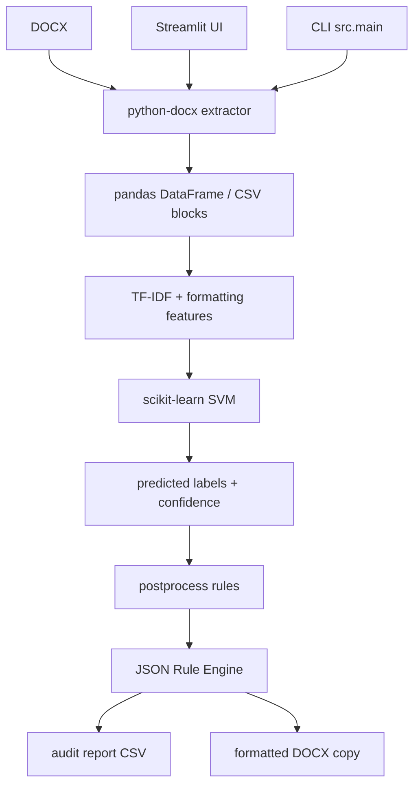

# Технологический стек: GOST Formatter

**Дата:** 2026-05-01  
**Статус:** Draft  
**Архитектура:** локальное Python-приложение с CLI + Streamlit UI, ML-классификатором и rule-based слоем нормоконтроля.  
**Источник:** требования и реализация, описанные в `Почти финал.docx`.

---

## 1. Архитектурная схема

```text
Пользователь / разработчик
    ↓
CLI или Streamlit UI
    ↓
DOCX extraction layer
    ↓
Feature engineering layer
    ↓
ML classification layer: TF-IDF + SVM
    ↓
Postprocessing layer
    ↓
Rule Engine / GOST audit layer
    ↓
CSV report + исправленный DOCX при безопасных изменениях
```



---

## 2. Ядро разработки

| Слой | Технология | Версия / ограничение | Назначение | Статус |
|---|---|---|---|---|
| Язык | Python | 3.10+ / 3.11+ рекомендуемо | основная реализация pipeline | Core |
| Управление окружением | venv / pip | фиксировать через `requirements.txt` | изоляция зависимостей | Core |
| IDE | Visual Studio Code | актуальная версия | разработка и отладка | Core |
| Контроль версий | Git | актуальная версия | история изменений, эксперименты, ветки | Core |
| ОС разработки | Windows / Linux / WSL | без жесткой привязки | локальная разработка | Core |
| Среда экспериментов | Kaggle / локальный запуск | опционально | обучение тяжелых моделей, анализ результатов | Optional |

---

## 3. Работа с документами

| Слой | Технология | Версия / ограничение | Назначение | Статус |
|---|---|---|---|---|
| DOCX parsing | python-docx | 1.1+ рекомендуемо | чтение абзацев, таблиц, стилей, форматирования | Core |
| DOCX formatting | python-docx | 1.1+ рекомендуемо | применение безопасных исправлений | Core |
| XML/OOXML low-level | lxml / стандартные XML-средства | при необходимости | расширенная работа с OOXML, если python-docx недостаточно | Optional |
| PDF parsing | PyMuPDF / pdfplumber | не входит в MVP | будущая поддержка PDF с текстовым слоем | Future |
| OCR | Tesseract / OCR-сервис | не входит в MVP | будущая поддержка сканов | Future |

### Решение по scope

DOCX является основным форматом MVP. PDF и OCR не включаются в критический путь реализации, чтобы не расширять систему за пределы фактически описанного и реализованного решения.

---

## 4. Данные и аналитический слой

| Слой | Технология | Версия / ограничение | Назначение | Статус |
|---|---|---|---|---|
| Табличные данные | pandas | 2.0+ рекомендуемо | загрузка CSV, подготовка датасетов, отчеты | Core |
| Численные операции | NumPy | совместимо с pandas/scikit-learn | работа с массивами признаков | Core |
| Разделение данных | scikit-learn utilities | совместимо с моделью | train/val/test split, preprocessing | Core |
| Хранение данных | CSV | UTF-8 | annotations, extracted blocks, predictions, reports | Core |
| Визуализация ошибок | matplotlib | актуальная стабильная версия | confusion matrix, графики метрик | Core |
| Расширенная визуализация | seaborn | optional | более удобные heatmap/plots при анализе | Optional |

### Основные файлы данных

| Категория | Пример | Назначение |
|---|---|---|
| Raw DOCX | `data/raw/docx/*.docx` | исходные документы |
| Prepared dataset | `data/prepared/annotations_prepared_all_59_clean.csv` | общий размеченный корпус |
| Train split | `data/prepared/annotations_train_59_clean.csv` | обучение модели |
| Validation split | `data/prepared/annotations_val_59_clean.csv` | подбор и промежуточная оценка |
| Test split | `data/prepared/annotations_test_59_clean.csv` | итоговая оценка |
| Class distribution | `class_distribution_59_clean.csv` | контроль дисбаланса классов |
| Reports | `results/reports/*.csv` | результаты аудита |

---

## 5. ML и NLP

| Слой | Технология | Версия / ограничение | Назначение | Статус |
|---|---|---|---|---|
| Векторизация текста | TF-IDF | scikit-learn `TfidfVectorizer` | преобразование текста блоков в признаки | Core |
| Основная модель | Linear SVM / LinearSVC | scikit-learn | классификация структурных блоков | Core |
| Baseline | Logistic Regression | scikit-learn | сравнение с базовым методом | Experiment |
| Метрики | sklearn.metrics | scikit-learn | accuracy, precision, recall, F1, confusion matrix | Core |
| Сохранение модели | joblib | 1.3+ рекомендуемо | сериализация pipeline/model artifacts | Core |
| Transformer experiment | Hugging Face Transformers | optional | RuBERT-эксперимент | Optional |
| Deep learning backend | PyTorch | optional, GPU желательно | обучение трансформерной модели | Optional |
| Optimizer | AdamW | через PyTorch/Transformers | обучение RuBERT-эксперимента | Optional |

### Принцип выбора модели

Основная production/MVP-конфигурация должна использовать SVM, потому что она показала устойчивое качество на ограниченном объеме размеченных документов, хорошо работает с разреженным TF-IDF-пространством и проще в сопровождении. Трансформерная модель остается исследовательским компонентом, так как не дала устойчивого практического преимущества в описанных экспериментах.

---

## 6. Rule Engine и нормоконтроль

| Слой | Технология / формат | Назначение | Статус |
|---|---|---|---|
| Правила | JSON | хранение формализованных правил оформления | Core |
| Rule loader | Python module | загрузка правил при запуске | Core |
| Rule matcher | Python module | выбор правил по predicted label | Core |
| Rule evaluator | Python module | сравнение фактических и ожидаемых параметров | Core |
| Safe autocorrect | Python + python-docx | применение безопасных исправлений | Core |
| Audit status | enum/string | `no_change`, `changed`, `review`, `error` | Core |

### Базовая структура правила

```json
{
  "id": "body_text_first_line_indent",
  "applicable_labels": ["body_text"],
  "parameter": "first_line_indent_cm",
  "expected_value": 1.25,
  "action": "check_or_fix",
  "severity": "medium",
  "autocorrect": true,
  "priority": 100
}
```

### Нормативные источники

| Источник | Назначение в системе | Статус |
|---|---|---|
| ГОСТ 7.32-2017 | структура отчетов, оформление научно-технических документов | Normative base |
| ГОСТ Р 7.0.97-2016 | реквизиты и организационно-распорядительная документация | Normative base / partial |
| ГОСТ Р 2.105-2019 | общие требования к текстовым документам, структура и нумерация | Normative base / future expansion |
| Методические указания вуза | локальные требования к ВКР, титульному листу, источникам | Profile extension |

---

## 7. CLI

| Команда / режим | Назначение | Вход | Выход | Статус |
|---|---|---|---|---|
| `train` | обучение модели | prepared CSV | model + metrics | Core |
| `evaluate` | оценка модели | test CSV + model | evaluation report | Core |
| `predict` | предсказание классов | extracted/prepared CSV | predictions CSV | Core |
| `extract-docx` | извлечение блоков из DOCX | DOCX | extracted blocks CSV | Core |
| `audit-docx` | аудит оформления | DOCX + predictions/model | report CSV + optional DOCX | Core |

### Требования к CLI

- Единая точка входа: `python -m src.main` или аналогичная.
- Все пути передаются через аргументы.
- Все результаты сохраняются в предсказуемую директорию.
- Ошибки аргументов и файлов должны быть понятны пользователю.
- Каждый режим должен быть пригоден для отдельного запуска и отладки.

---

## 8. Пользовательский интерфейс

| Слой | Технология | Назначение | Статус |
|---|---|---|---|
| UI framework | Streamlit | загрузка документа, запуск аудита, просмотр результатов | Core / current UI |
| Таблицы результатов | Streamlit dataframe | просмотр классификации и аудита | Core |
| File upload | Streamlit uploader | загрузка DOCX | Core |
| Download buttons | Streamlit download | скачивание отчета и исправленного DOCX | Core |

### UI-сценарий

```text
Открыть интерфейс
  → загрузить DOCX
  → выбрать профиль проверки
  → запустить анализ
  → увидеть сводку
  → открыть таблицу блоков
  → посмотреть нарушения и confidence
  → скачать CSV-отчет
  → скачать исправленный DOCX при наличии безопасных исправлений
```

### Не включается в текущий UI

- Авторизация и учетные записи.
- Хранение истории проверок.
- Совместная работа нескольких пользователей.
- Редактирование документа прямо в браузере.
- Полноценный визуальный diff исходного и исправленного документа.

---

## 9. Файловая структура проекта

Рекомендуемая структура:

```text
gost_formatter/
  data/
    raw/
      docx/
      pdf/
    annotations/
    prepared/
  rules/
    gost_7_32_2017.json
    gost_r_7_0_97_2016.json
    local_university_profile.json
  src/
    main.py
    extraction/
    preprocessing/
    features/
    models/
    training/
    evaluation/
    postprocess/
    audit/
    formatting/
    ui/
    utils/
  results/
    models/
    metrics/
    predictions/
    extracted_blocks/
    reports/
    formatted_docs/
  tests/
  requirements.txt
  README.md
```

Фактическая структура может отличаться, но перечисленные зоны должны быть логически разделены.

---

## 10. Качество кода и тестирование

| Слой | Технология | Назначение | Статус |
|---|---|---|---|
| Unit tests | pytest | тестирование функций извлечения, признаков, правил | Recommended |
| Type hints | Python typing | читаемость и устойчивость к ошибкам | Recommended |
| Formatting | black / ruff format | единый стиль кода | Recommended |
| Linting | ruff | статическая проверка Python-кода | Recommended |
| ML validation | sklearn metrics | проверка качества модели | Core |
| Manual QA | тестовые DOCX | проверка отчета и исправленного документа | Core |

### Минимальный набор тестов

- Тест чтения DOCX с обычными абзацами.
- Тест чтения DOCX с таблицами.
- Тест извлечения `alignment`, `style`, `bold_ratio`.
- Тест валидации обязательных колонок датасета.
- Тест применения одного JSON-правила.
- Тест блокировки автокоррекции при низком confidence.
- Тест формирования audit report.
- Тест сохранения исправленного DOCX без перезаписи исходника.

---

## 11. Инфраструктура

| Слой | Технология | Назначение | Статус |
|---|---|---|---|
| Локальная разработка | Windows + venv / WSL + venv | основной сценарий разработки | Core |
| Эксперименты | Kaggle GPU / CPU | опциональное обучение трансформеров | Optional |
| CI | GitHub Actions | запуск тестов и линтеров | Recommended |
| Хранилище артефактов | локальная файловая система | модели, отчеты, предсказания | Core |
| Docker | Docker / Docker Compose | воспроизводимый запуск | Future / Recommended |

### Аппаратные требования

| Режим | CPU | RAM | GPU | Комментарий |
|---|---:|---:|---:|---|
| Извлечение DOCX | обычный CPU | 4 GB+ | не требуется | легкий режим |
| SVM train/evaluate | обычный CPU | 8 GB+ | не требуется | основной режим MVP |
| Predict/audit | обычный CPU | 4–8 GB | не требуется | пользовательский режим |
| Transformer training | CPU нежелателен | 12–16 GB+ | желательно | экспериментальный режим |

---

## 12. Зависимости `requirements.txt`: рекомендуемый состав

```txt
pandas>=2.0
numpy>=1.26
scikit-learn>=1.3
scipy>=1.10
joblib>=1.3
python-docx>=1.1
matplotlib>=3.8
streamlit>=1.35

# optional transformer experiments
torch>=2.1
transformers>=4.40
safetensors>=0.4

# optional quality tools
pytest>=8.0
ruff>=0.5
mypy>=1.8
```

Примечание: версии должны быть зафиксированы после проверки в фактическом окружении проекта. Для дипломной реализации важнее воспроизводимость и совместимость, чем использование самых новых версий.

---

## 13. Артефакты и директории результатов

| Артефакт | Формат | Директория | Назначение |
|---|---|---|---|
| Обученная модель | `.joblib` | `results/models/` | повторное использование классификатора |
| Training metrics | `.json`, `.txt` | `results/metrics/` | анализ качества обучения |
| Evaluation report | `.json`, `.txt`, `.csv` | `results/metrics/` | итоговая оценка |
| Confusion matrix | `.png`, `.csv` | `results/metrics/` | анализ ошибок |
| Extracted blocks | `.csv` | `results/extracted_blocks/` | результат DOCX extraction |
| Predictions | `.csv` | `results/predictions/` | роли блоков и confidence |
| Audit report | `.csv` | `results/reports/` | нарушения, статусы, рекомендации |
| Formatted DOCX | `.docx` | `results/formatted_docs/` | исправленная копия документа |

---

## 14. Известные риски технологического стека

| Риск | Вероятность | Влияние | Митигация |
|---|---|---|---|
| `python-docx` не покрывает все OOXML-случаи | MED | HIGH | использовать консервативные правила, при необходимости lxml/OOXML patching |
| Списки в DOCX представлены неоднозначно | HIGH | HIGH | не применять агрессивную автокоррекцию, фиксировать review |
| SVM зависит от качества разметки и признаков | HIGH | MED | усиливать датасет, анализировать ошибки, class weights |
| Трансформер требует GPU и больше данных | MED | MED | оставить как optional experiment |
| JSON-правила могут разрастись и стать несогласованными | MED | MED | ввести JSON schema, тесты правил, профили |
| Streamlit ограничен для production-сценариев | MED | LOW/MED | использовать как прототип UI; для production рассмотреть FastAPI + frontend |
| CSV-обмен может стать неудобным при росте системы | MED | MED | при необходимости перейти к SQLite/PostgreSQL, но не в MVP |

---

## 15. Что не входит в основной стек текущей версии

- Next.js / React frontend.
- FastAPI backend.
- PostgreSQL как обязательная база данных.
- Авторизация, роли, личные кабинеты.
- Redis / Celery / очереди задач.
- S3-хранилище документов.
- Document AI cloud services.
- OCR как обязательный компонент.
- LayoutLM / LayoutLMv3 как обязательное ядро.

Эти технологии могут быть рассмотрены для будущей production-версии, но они не соответствуют текущему фактическому scope дипломной реализации.

---

## 16. Рекомендуемый future production stack

Если система будет развиваться из дипломного прототипа в многопользовательский продукт, возможна следующая архитектура:

| Слой | Технология | Назначение |
|---|---|---|
| Backend API | FastAPI | API для загрузки документов, запуска аудита, получения отчетов |
| Frontend | Next.js + React | полноценный пользовательский интерфейс |
| DB | PostgreSQL | пользователи, документы, история проверок, профили правил |
| Task queue | Celery / Dramatiq / RQ | фоновые проверки документов |
| Storage | S3/MinIO | хранение исходных и исправленных DOCX |
| Auth | JWT / session cookies | учетные записи и роли |
| Monitoring | Sentry + structured logs | диагностика ошибок |
| Containerization | Docker Compose | воспроизводимый деплой |

Этот стек не должен смешиваться с MVP-требованиями. Он является направлением развития, а не описанием уже реализованной системы.
